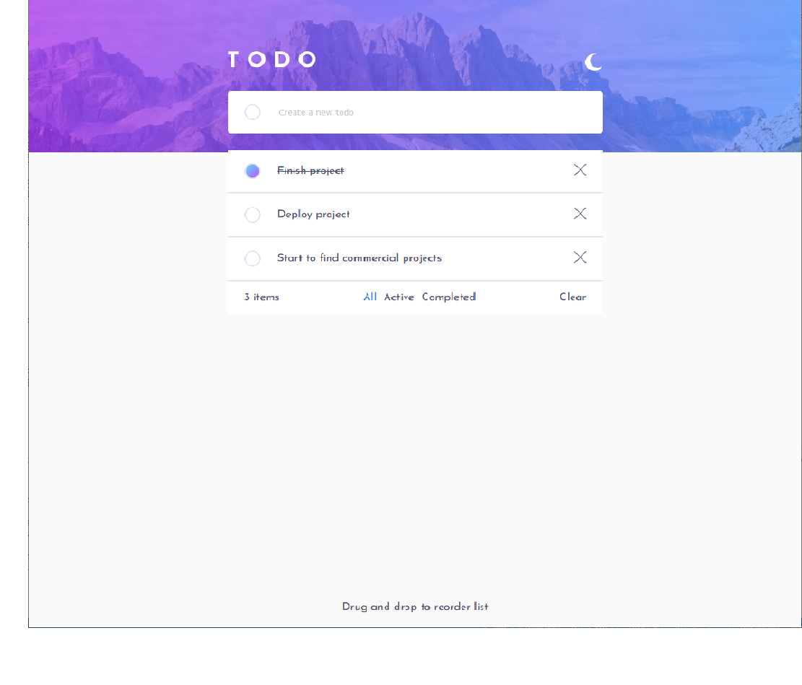
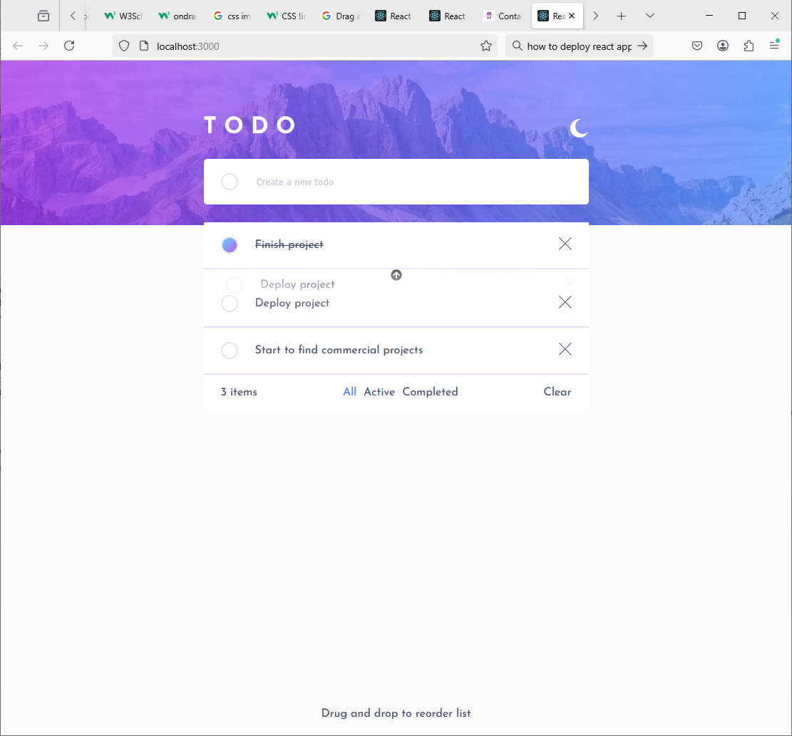
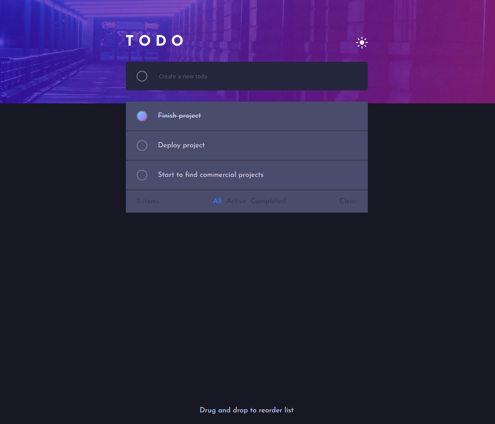
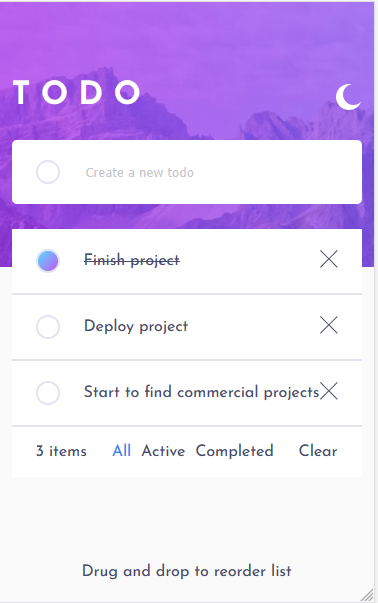
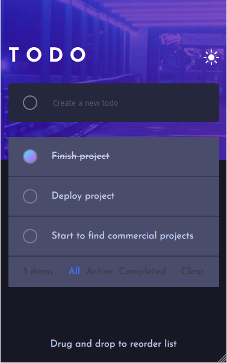

# Frontend Mentor - Calculator app solution

This is a solution to the [Calculator app challenge on Frontend Mentor](https://www.frontendmentor.io/challenges/calculator-app-9lteq5N29). Frontend Mentor challenges help you improve your coding skills by building realistic projects.

## Table of contents

- [Overview](#overview)
  - [The challenge](#the-challenge)
  - [Screenshot](#screenshot)
  - [Links](#links)
- [My process](#my-process)
  - [Built with](#built-with)
- [Author](#author)
- [Acknowledgments](#acknowledgments)

## Overview

### The challenge

Users should be able to:

- See the size of the elements adjust based on their device's screen size
- Work with todos (create, edit, delete and change todo's position in the list by drag and drop)
- During using drag and drop - todo will insert to arrow pointed interval
- Adjust the color theme based on their preference

### Screenshot

#### Light Theme

#### Light Theme Draging

#### Dark Theme

#### Phone Light Theme

#### Phone Dark Theme

### Links

- [Sources URL](https://github.com/hfridland/todo-list-tailwind)
- [Live Site URL](https://hfridland.github.io/todo-list-tailwind)

## My process

### Built with

- Semantic HTML5 markup
- Tailwind
- Tailwind custom properties
- Flexbox
- [React](https://reactjs.org/) - JS library

## Author

- email - hfridland@gmail.com
- Frontend Mentor - [@hfridland](https://www.frontendmentor.io/profile/hfridland)
- LinkedIn - [Haim Fridland](https://www.linkedin.com/in/haim-fridland-a8b28315/)
